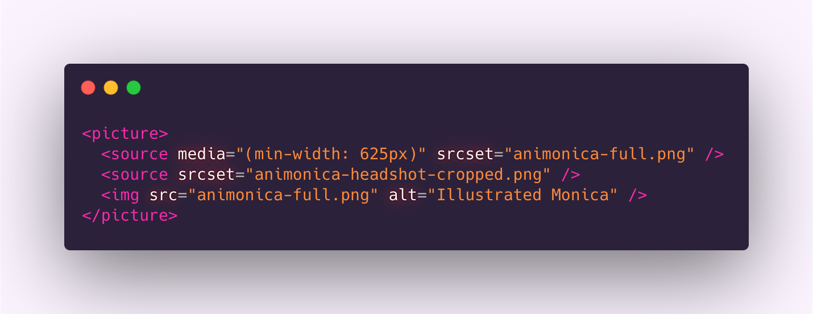

slide-transition: true
footer: 👩🏾‍💻 www.monica.dev | 🐦 @waterproofheart

# Keeping SSR Cool with React Hydration

## Monica Powell

React Rally 2020

---

# Hi, I'm Monica 👋🏾

I'm a software engineer who enjoys building technology that elevates people whether that's increasing access to e-books, creating tools for Meetup's community organizers or sending curated career opportunities to diverse job-seekers at scale. I'm also passionate about making open-source more accessible and recently became an inaugural GitHub Star 🌟

---

# Overview

The purpose of this talk is to share some helpful things to keep in mind to render a seamless experience as a Server-Side Rendered (SSR) site transitions from a window-less (server) environment to a browser.

SSR apps tend to have faster initial loading Tims and better SEO than client-side only apps.

^ Server-side rendering can be powerful but it does require thinking in multiple contexts and I want to share some of the gotchas I've run into while developing Server-Side Rendered websites.

---

# What is Server-Side Rendering (SSR)?

A server generates the initial HTML that loads in a browser from JavaScript. Frameworks like NextJS and GatsbyJS support SSR out-of-the box

^ There are multiple types of Server-Side Rendering for example SSR can be used to render every single page request or only the initial page request. NextJS offers more robust server-side support than Gatsby. In contrast, you may be familiar with Create React App which does NOT come with SSR functionality out of the box.

---

# What is Client-Side Rendering?

^ With Client-Side Rendering you must have HTML enabled in order to view content on the site.

---

# Client-Side Initial DOM

^ If you look at the DOM on an a Create React App you'll notice very little HTML markup in the DOM. You'll see the root where React is injected, a message saying you need to enable JavaScript to run the app as well as script tags that link to the JavaScript that needs to be loaded to hydrate the page.

---

# Overview of SSR (in static context)

^ Write site in React ⚛️ -> Gatsby creates a production build of your site using ReactDOMServer, a React server-side API to generate HTML from React. -> Someone visits your website and the HTML generated from the server is displayed on the page -> ReactDOM.hydrate(), hydrates the HTML page that was rendered from the server with JavaScript -> React reconciler APIs take over

---
# Toggling JavaScript

- GatsbyJS vs. Create React App

^ Let's take a look at what happens when JavaScript is enabled or disabled in a Create React App or Gatsby App

---

^Create-React-App in contrast uses client-side rendering where the browser is responsible for constructing the initial HTML therefore, we just see the bare bones HTML as opposed to a full HTML document with initial content.

---

# Important Notes

- User or browser-specific data is not available in the server when HTML for the site is generated (i.e., window size, authentication status, local storage etc)

^ In this image you'll see that the store location data, my username and items in shopping cart were not available on initial page load. Patterns like this can be common on server-side rendered applications.

---

# What could go wrong? 😅

^ Developing in an SSR context can introduce a new set of issues as you need to consider how the page loads BEFORE JavaScript is available since JavaScript is not required for the page to load. 

---

# Debugging SSR Hydration Issues 🐞

- Disable JavaScript

- View filmstrips to see how the website hydrates

^ You may notice weird changes on initial page load that change too quickly to properly inspect. But there's another way to slow down and really see what is going on. You can disable JavaScript and also use a site like webpage speed test to generate thumbnails that show you exactly how the page is loading step by step.

---

Before: Styled icons with CSS from Font Awesome NPM Package

^ Here's a waterfall I took of the issue on my site. You can see one of the issues is that the size of the icons changes drastically between 96% and 99% loaded which can be a disjointing experience.

---

# Solution

- Replicate the final styling with local CSS without relying on FontAwesome's external CSS which required JavaScript to be applied

^ Once I disabled JavaScript, I was able to discover that the ways the icons look before they were fully loaded mirrored the app without JavaScript, I determined font awesome was using its own styling that was coming in through JS. In order to resolve the issue I disabled font awesome's external CSS since it's loaded via JavaScript and replicated the css I wanted locally.

---

After: Styling icons locally and disable Font Awesome's CSS

^ Now you'll notice that the styling of the icons is consistent as the application loads

---

# Immutable Layout

- Avoid unnecessary layout shifts during page load

- Implement layouts with placeholder/gap for expected client-side content

* Use CSS instead of JS to style the page

^Another culprit in the previous example was using JS to position content instead of media queries. CSS loads before JS and is less resource-intensive. This can be a common issue when loading the page as there may still be some data unavailable as the page loads. You ca n try to design around this by leaving room for data to come in, for example in the Target nav there was no shift as the user/store specific data loaded. You should also use CSS instead of JavaScript for styling ;) 

^Learn more at: https://www.speedpatterns.com/patterns/immutable_layout.html

---

> "JavaScript is a powerful language that can do some incredible things, but it’s incredibly easy to jump to using it too early in development, when you could be using HTML and CSS instead...

-- Iain Bean, Your blog doesn’t need a JavaScript framework

---

> ...Consider the rule of least power: Don’t use the more powerful language (JavaScript) until you’ve exhausted the capabilities of less powerful languages (HTML)."

-- Iain Bean, Your blog doesn’t need a JavaScript framework

---

# Art Direction: Rule of Least Power

^ I want to walk through a time I recently used the rule of least power to make the initial page load faster and reduce relying on JavaScript to dynamically load different images on my site

---

# Art Direction: HTML or Javascript?

- HTML art direction can be used to dynamically load of images based on screen size using srcset attributes with `` and `<source>` instead of JavaScript.

---

# Art Direction: Why HTML?

- Swapping images at different screen sizes can be done with JavaScript or CSS instead of native HTML attributes however using HTML can improve page loading performance as it prevents unnecessarily preloading two images

---

# Art Direction in HTML

^In order to set up this functionality in HTML you can use the picture attribute and set media queries on each source image. It will return the first condition the is true and as a fall back it'll return the image from the img tag.

---

---

# Summary

- When developing in a Server-Side Rendered context it's important to consider _how_ the page loads and what data is or is not available on initial page load.
- CSS is a better tool for styling, especially in a Server-Side Rendered app

---
# Resources
- https://www.gatsbyjs.org/docs/react-hydration/
- https://joshwcomeau.com/react/the-perils-of-rehydration/
- https://reactjs.org/docs/reconciliation.html
- https://www.webpagetest.org/

---
# Thank You!

## See you in CYBERSPACE 👋🏾

@waterproofheart

👩🏾‍💻 www.monica.dev
