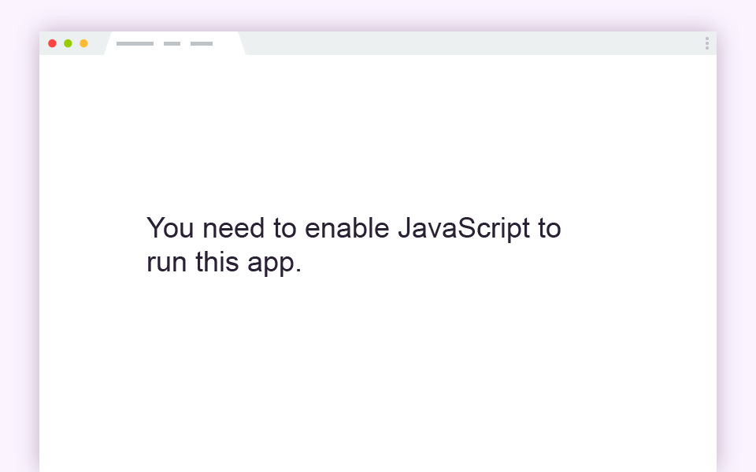
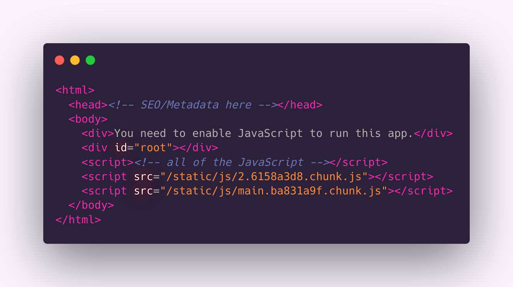

slide-transition: true
footer: 👩🏾‍💻 www.monica.dev | 🐦 @waterproofheart

# Keeping SSR Cool with React Hydration

## Monica Powell

React Rally 2020

---

# Hi, I'm Monica 👋🏾

I'm a software engineer who enjoys building technology that elevates people whether that's increasing access to e-books, creating tools for Meetup's community organizers or sending curated career opportunities to diverse job-seekers at scale. I'm also passionate about making open-source more accessible and recently became an inaugural GitHub Star 🌟

^ I'm Monica! I'm a software engineer and community organizer. I'm passionate about making technology, like open-source, more accessible and created a Meetup group, React Ladies for women and non-binary react developers.

---

# Overview

The purpose of this talk is to share some helpful things to keep in mind to render a seamless experience as a Server-Side Rendered (SSR) site transitions from a window-less (server) environment to a browser.

^ The purpose of this talk is for me share some helpful things you should keep in mind to render a seamless Server-Side Rendered experience. Server-side rendering can be powerful but it does require thinking in multiple contexts so I will be sharing some of the gotchas I've run into while developing Server-Side Rendered websites.

---

# What is Server-Side Rendering (SSR)?

A server generates the initial HTML that loads in a browser. Frameworks like NextJS and GatsbyJS support SSR out-of-the box

^ Let's take a step back. First what is server-side rendering? When a server generates the initial HTML that loads in a browser. Frameworks like NextJS and GatsbyJS support SSR out-of-the box.

There are multiple types of Server-Side Rendering for example SSR can be used to render every single page request or only the initial page request. NextJS offers more server-side configurations than Gatsby. You may be familiar with Create React App which does NOT come with SSR functionality out of the box.

---

# Why Server-Sider Rendering (SSR)?

SSR apps tend to have faster initial loading times and better SEO than client-side only apps.

^ A couple notable benefits of Server Side Rendered applications is that they tend to load initial ocntent faster and lead to higher SEO rankings.

---

# What is Client-Side Rendering (CSR)?

^ In contrast, a website that only supports Client-Side Rendering requires visitors to have HTML enabled in order to view content on the site. Note visitors may see a largely a blank page if they do not have JavaScript enabled.

---

# Client-Side Rendered Initial DOM

^ If you look at the DOM in the developer tools of a Create React App (or client-side only rendered application) you'll notice very little HTML markup in the DOM. You'll see the root where React is injected, a message saying you need to enable JavaScript to run the app as well as script tags that link to the JavaScript that needs to be loaded to hydrate the page.

---

# Overview of SSR (in static context)

^ Let's walk through what happens in Server-Side Rendered applications like NextJS or Gatsby when all the pages for the site are built at once in the server. First you write the site in React ⚛️ -> then Gatsby creates a production build of your site using ReactDOMServer, a React server-side API to generate HTML from React. -> When someone visits your website and the first thing they'll see is the HTML generated from the server -> then once JavaScript has loaded the ReactDOM.hydrate() API kicks in to hydrates the HTML page that was rendered from the server with JavaScript -> After Hydration the React reconciler APIs take over and the site becomes interactive

---

# Toggling JavaScript

- SSR vs CSR

^ Let's take a look at what happens when JavaScript is enabled or disabled in a Server-Side rendered app vs a Client-Side only rendered application. I used Gatsby and Create React App for these technologies.

---

^As JavaScript is toggled on/off we see there is very little visible change on the left, Gatsby-powered site aside from the image loading. On the rightm we see Create-React-App which uses client-side rendering and the browser is responsible for constructing the initial HTML. Due to this we just see the bare bones HTML as opposed to a full HTML document when JavaScript is disabled.

---

# It looks great in development...What could go wrong? 😅

- Layout shifts that only appear in production
- Errors that only appear at build-time

^ So we just looked at an example of Server-Side rendering that looked great in production both with JavaScript enabled or disabled. What could go wrong? There are some common issues you might run into with Server-Side rendered applications that only occur during the initial hydration process in production or errors that appear at build-time.

---

# Missing Data on Server-Side ⚠️

- User or browser-specific data is not available in the server when static HTML for the site is generated (i.e., window size, authentication status, local storage etc)

- Static-site-generation (SSG) is when all of the pages for a site are generated at build time

^ Something helpful to keep in mind is that there's some data that just isn't available in the static server context like user or browser specific data. For example, window size, authentication status, local storage etc.

^In this image of Target's navigation you'll see that the store location data, my username and items in shopping cart were not available on initial page load. Patterns like this can be common on server-side rendered applications.

---

# Debugging SSG Hydration Issues 🐞

^ Let's debug the hydration issue that caused my site to have unecessary rendering changes during load. A huge piece of missing data that can cause issues in server-side rendered applications in missing JavaScript! It's a best-practice to load CSS before JavaScript therefore you need to consider how the HTML/CSS on a page loads BEFORE JavaScript is available since JavaScript is not required for the page to load.

---

# Debugging SSG Hydration Issues 🐞

- Disable JavaScript

- View filmstrips to see how the website hydrates

^ You may end up noticing weird changes on initial page load that change too quickly to properly inspect - especially if you have a faster internet connection. But there are ways to slow down and really see what is going on. I'd recommend disabling JavaScript in your browser or using a site like webpage speed test to generate film strip thumbnails that show you exactly how the page is loading step by step.

---

Before: Styled icons with CSS from Font Awesome NPM Package

^ This is the waterfall I took of the issue on my site before it was resolved. You can see one of the issues is that the size of the icons changes drastically between 96% and 99% loaded which can be a disjointing experience.

---

# Solution for Icons Resizing on Load

- Replicate the final styling with local CSS without relying on FontAwesome's external CSS which required JavaScript to be applied

^ Once I disabled JavaScript, I was able to discover that the ways the icons look before they were fully loaded mirrored the app without JavaScript, I determined font awesome was using its own styling that was coming in through JS. In order to resolve the issue I disabled font awesome's external CSS since it's loaded via JavaScript and replicated the CSS styles I wanted locally. Since CSS loads before JS this resolved the issue.

---

After: Styling icons locally and disable Font Awesome's CSS

^ You'll notice after removing the dependency on Font Aweomsome's CSS that the styling of the icons is consistent as the application loads

---

# Immutable Layout

- Avoid unnecessary layout shifts during page load

^ The previous issue is related to a much larger issue of handling layouts on the server-side.

---

# Immutable Layout

- Implement layouts with placeholder/gap for expected client-side content

* Use CSS instead of JS to handle the layout of the page

^You can minimize layout shifts by avoid using JS to position or style content instead of CSS. It is common for some data to be unavailable as the page loads. You should consider developing in a way that can handle missing data by leaving room for data to come in. For example in the Target navigation example we saw earlier there was no shift as the user/store specific data loaded.

---

# Conditional Rendering

^ https://carbon.now.sh/?bg=rgba(251%2C244%2C255%2C1)&t=synthwave-84&wt=none&l=javascript&ds=true&dsyoff=20px&dsblur=68px&wc=true&wa=true&pv=56px&ph=56px&ln=false&fl=1&fm=Hack&fs=14px&lh=133%25&si=false&es=2x&wm=false&code=%250A%2520%2520%2520%2520if%2520(small)%2520%257B%250A%2520%2520%2520%2520%2520%2520return%2520%253CMobileApp%2520%252F%253E%250A%2520%2520%2520%2520%257D%2520else%2520%257B%250A%2520%2520%2520%2520%2520%2520return%2520%253CDesktopApp%2520%252F%253E%250A%2520%2520%2520%2520%257D%250A%2520

^ If you write React you may have conditionally rendered content like this based on screen size using the MatchMedia API

---

# matchMedia in Server Context ⚠️

- With the `matchMedia()` Web API you can't reliably detect the browser size in the server which leads to strange layout shifts when the initial positioning is incorrect.

^ However, the `matchMedia()` API can't reliably detect the browser or device size in the server context which can lead to some strange rendering issues as the page loads if the originally set media size doesn't match the actual browser.

---

# CSS in Server Context 💅🏽

- Use CSS media queries directly or a library like arts/fresnel that wraps all `Media` components in css.

^ It's preferable to use CSS or a library like fresnel which wraps all `Media` components in CSS instead of MatchMedia in Server-Side rendered applications to layout content. Since CSS loads before JS, styles applied via CSS, unlike JavaScript should visibly match what you expect on page load.

---

^ Here's an example of how Fresnel can be used. First you need to import createMedia from Fresnel then define the breakpoints and export MediaContextProvider from the object created from createMedia to wrap the entire app. Then you can use Fresnel's Media component throughout your app to render components based on the predefined breakpoints. The final step, which you can read more about in the Fresnel docs, is passing mediaStyle into a <style> tag in the head of the document so that CSS can be generated from fresnel markup and be rendered on the server. https://carbon.now.sh/?bg=rgba(251%2C244%2C255%2C1)&t=synthwave-84&wt=none&l=javascript&ds=true&dsyoff=0px&dsblur=68px&wc=true&wa=true&pv=56px&ph=56px&ln=false&fl=1&fm=Hack&fs=14px&lh=133%25&si=false&es=2x&wm=false&code=import%2520React%2520from%2520%2522react%2522%250Aimport%2520ReactDOM%2520from%2520%2522react-dom%2522%250Aimport%2520%257B%2520createMedia%2520%257D%2520from%2520%2522%2540artsy%252Ffresnel%2522%250A%250Aconst%2520%257B%2520MediaContextProvider%252C%2520Media%2520%257D%2520%253D%2520createMedia(%257B%250A%2520%2520breakpoints%253A%2520%257B%250A%2520%2520%2520%2520sm%253A%25200%252C%250A%2520%2520%2520%2520md%253A%2520768%250A%2520%2520%257D%252C%250A%257D)%250A%250Aconst%2520App%2520%253D%2520()%2520%253D%253E%2520(%250A%2520%2520%253CMediaContextProvider%253E%250A%2520%2520%2520%2520%253CMedia%2520at%253D%2522sm%2522%253E%250A%2520%2520%2520%2520%2520%2520%253CMobileApp%2520%252F%253E%250A%2520%2520%2520%2520%253C%252FMedia%253E%250A%2520%2520%2520%2520%253CMedia%2520greaterThan%253D%2522sm%2522%253E%250A%2520%2520%2520%2520%2520%2520%253CDesktopApp%2520%252F%253E%250A%2520%2520%2520%2520%253C%252FMedia%253E%250A%2520%2520%253C%252FMediaContextProvider%253E%250A)%250A%250AReactDOM.render(%253CApp%2520%252F%253E%252C%2520document.getElementById(%2522react%2522))

---

# Error: Window is undefined

^ If you try to access browser specific elements in a server context JavaScript will not be able to resolve those elements.

---

# Error: Window is undefined

When building a site you might run into the `window is undefined` or `document is undefined` error. This happens when logic within an app assume the **browser** window is defined in a **server**

^ In particular you may run inwo window is undefined or browser is undefined errors which happens when you try to reference these browser-specific elements in the server

---

# Error: Window is undefined

Your first inclination to resolve the undefined Window error might be to write something like:

^ Your first inclination to resolve the undefined Window error might be to write something like if typeof window !== defined render this else don't render this.

---

# ReactDOM.hydrate Constraints

ReactDOM.hydrate:  
👯‍♂️ expects that the rendered content is **identical** between the server and the client.

🙅🏾‍♀️ does not guarantee that attribute differences will be patched up in case of mismatches.

^https://carbon.now.sh/?bg=rgba(251%2C244%2C255%2C1)&t=synthwave-84&wt=none&l=javascript&ds=true&dsyoff=20px&dsblur=68px&wc=true&wa=true&pv=56px&ph=56px&ln=false&fl=1&fm=Hack&fs=14px&lh=133%25&si=false&es=2x&wm=false&code=%250A%2520%2520%2520%2520typeof%2520window%2520!%253D%253D%2520undefined%2520%253F%2520%252F%252F%2520render%2520component%2520%253A%2520%252F%252F%2520return%2520null

^ However, the Hydrate API that converts HTML to full-fledged React expect that the content is indentical between the server and client and does not guarantee that matches will be patched up in case of mismatches. Due to this lack of guarantee it is NOT a good idea to conditionally render based on elements that will differ between the server and client.

---

# Safely Access Browser Elements

- Avoid reconciliation error when ReactDOM.hydrates a site from HTML -> React.

- Wrap React that can only render when Window or document is defined in useEffect which only fires _after_ the component has mounted.

^ In order to avoid issues with the hydration reconciliation process you can wrap any side effects that rely on the Window or Document in a useEffect since that only fires after the component has mounted.

---

# useEffect Example

(example from React docs)

^ This is an example from the React Docs of referencing a browser element, document.title within useEffect. This code will never be executed on the server.
^
https://carbon.now.sh/?bg=rgba(251%2C244%2C255%2C1)&t=synthwave-84&wt=none&l=javascript&ds=true&dsyoff=20px&dsblur=68px&wc=true&wa=true&pv=56px&ph=56px&ln=false&fl=1&fm=Hack&fs=14px&lh=133%25&si=false&es=2x&wm=false&code=function%2520Example()%2520%257B%250A%2520%2520const%2520%255Bcount%252C%2520setCount%255D%2520%253D%2520useState(0)%253B%250A%250A%2520%2520useEffect(()%2520%253D%253E%2520%257B%250A%2520%2520%2520%2520document.title%2520%253D%2520%2560You%2520clicked%2520%2524%257Bcount%257D%2520times%2560%253B%250A%2520%2520%257D)%253B%250A%257D

---

> "JavaScript is a powerful language that can do some incredible things, but it’s incredibly easy to jump to using it too early in development, when you could be using HTML and CSS instead...

-- Iain Bean, Your blog doesn’t need a JavaScript framework

---

> ...Consider the rule of least power: Don’t use the more powerful language (JavaScript) until you’ve exhausted the capabilities of less powerful languages (HTML)."

-- Iain Bean, Your blog doesn’t need a JavaScript framework

---

# Summary

- In a Server-Side Rendered context it's important to consider _how_ the page loads and when data is or is not available.
- CSS is the right tool for handling layout.
- Guard references to browser specific elements like `document` or `window` within `useEffect()` to avoid reconciliation error as the page hydrates

---

# Resources + Further Reading

- https://www.gatsbyjs.org/docs/react-hydration/
- https://joshwcomeau.com/react/the-perils-of-rehydration/
- https://reactjs.org/docs/reconciliation.html
- https://www.webpagetest.org/
- https://github.com/artsy/fresnel

^ Here are some resources I recommend if you're looking to further explore the rendering process for server-side rendered React applications.

---

# Thank You!

## See you in CYBERSPACE 👋🏾

@waterproofheart

👩🏾‍💻 www.monica.dev/reactrally

^ Thank you React Rally for having me! You can connect with me on Twitter @waterproofheart and view the content of this presentation at www.monica.dev/reactrally
