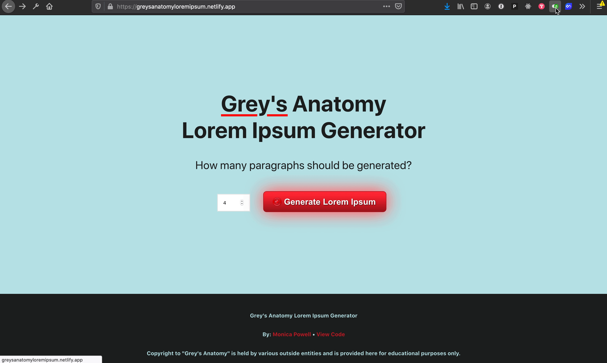
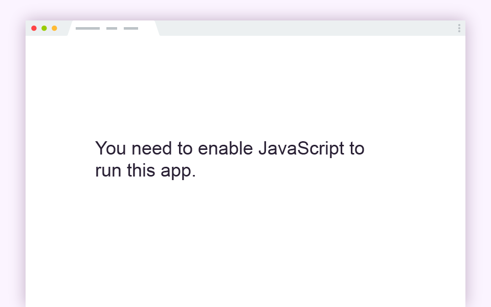
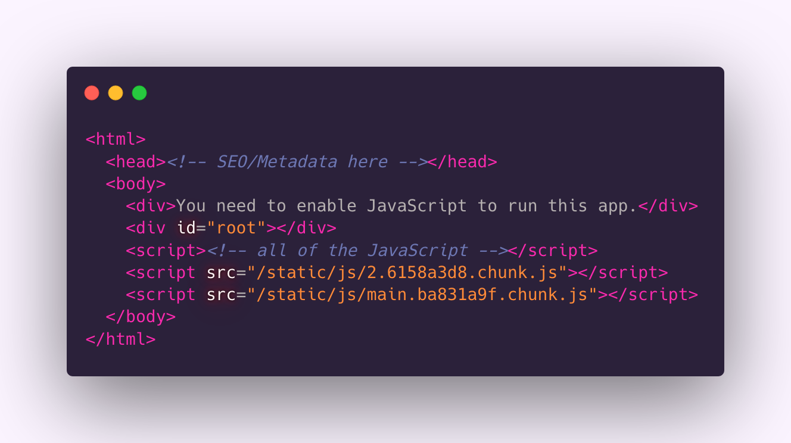
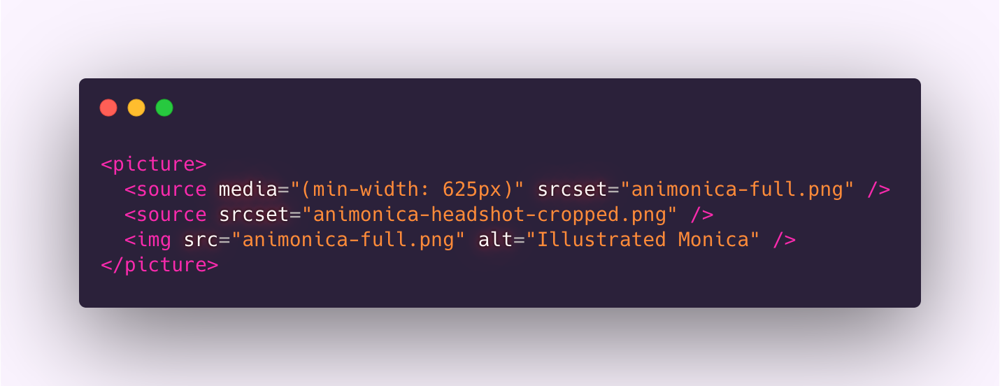
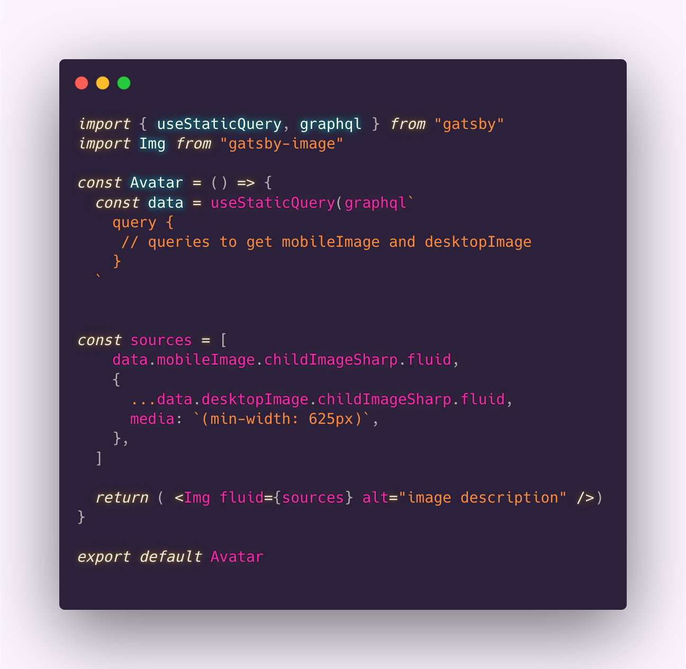

# Keeping SSR Cool with React Hydration
## Monica Powell
React Rally 2020

---
# Hi, I'm Monica 👋🏾
I'm a software engineer who enjoys building technology that elevates people whether that's increasing access to e-books, creating tools for Meetup's community organizers or sending curated content to diverse job-seekers at scale. I'm also passionate about making open-source more accessible and was recently selected to be an inaugural GitHub Star 🌟 

---

# Server-Side Rendering
A server to generates the initial HTML that loads in a browser from JavaScript.  Frameworks like NextJS and GatsbyJS support SSR out-of-the box

Create-React-App in contrast uses **client-side rendering** where the browser constructs the initial HTML.

---

# Toggling JavaScript

- GatsbyJS vs. Create React App

---

---
# Client-side rendering

---
# Client-side rendering

---

# High-Level Overview of SSR in Gatsby 
1. You write your website in React.
2. Gatsby creates a production build of your website using ReactDOMServer, a React server-side API to generate HTML from React.
3. Someone visits your website and the HTML generated from the server is displayed on the page.
4. ReactDOM.hydrate(), hydrates the HTML page that was rendered from the server with JavaScript
5. After ReactDOM hydrates the page with JavaScript, the React reconciler takes over to efficiently handle component updates
---
# What could go wrong? 🤷🏾‍♀️
---
# What could go wrong? 😅
Placeholder for demo of logged in vs. logged out or welcome back vs welcome!

---
# What could go wrong? 😅

- Some data is not available in the server (i.e., browser size, authentication status, local storage etc)

---
# What could go wrong? 😅
- Some data is not available in the server (i.e., browser size, authentication status, local storage etc)
  
---

# What could go wrong? 😅

--- 

# Reproduce Initial State

- Disable JavaScript

 - See how the static website looks prior to hydration
  

--- 

# Solution 
- Replicate the final styling with local CSS without relying on FontAwesome's external CSS which required JavaScript to be applied

---

Before: Styled icons with CSS from Font Awesome NPM Package

---

After: Styling icons locally and disable Font Awesome's CSS

---

# Immutable Layout
Changing layout as page loads

- Set up page layouts so that there's a placeholder/gap for the expected content
 

- Use CSS instead of JS to handle styling the page. Another cultprit in the previous example was using JS to position content instead of  media queries. CSS loads before JS and is less resource-intensive 

Learn more at: https://www.speedpatterns.com/patterns/immutable_layout.html   

--- 

> "JavaScript is a powerful language that can do some incredible things, but it’s incredibly easy to jump to using it too early in development, when you could be using HTML and CSS instead...

-- Iain Bean, Your blog doesn’t need a JavaScript framework

 

--- 

> ...Consider the rule of least power: Don’t use the more powerful language (JavaScript) until you’ve exhausted the capabilities of less powerful languages (HTML). Client-side JavaScript has a cost and developers should be aware of it."

-- Iain Bean, Your blog doesn’t need a JavaScript framework

 

---

# Using rule of least power to dynamically load images

---

# Using rule of least power to dynamically load images

- HTML art direction can be used to dynamically load of images based on screen size using srcset attributes with `` and `<source>` instead of JavaScript.
 

---

# Using rule of least power to dynamically load images

 
- Swapping images at different screen sizes can be done with JavaScript or CSS instead of native HTML attributes however using HTML can improve page loading performance as it prevents unnecessarily preloading two images

---
# Art Direction in HTML 

---
# Art Direction in Gatsby

---

---

# Output of Gatsby Image Art Direction Resembles

---
# Thank You!
## See you in CYBERSPACE 👋🏾

@waterproofheart

👩🏾‍💻 www.monica.dev